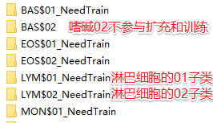
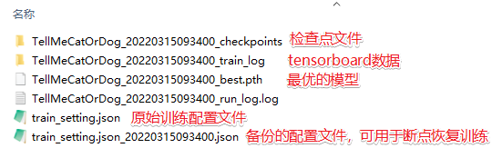

# 分类（识别）模型训练框架使用说明

## 使用步骤

### A. 数据集准备

1. 数据存储：训练用的图像数据以文件夹存储，每个分类文件夹必须以`主类名$子类序号_NeedTrain`格式命名，否则无法被本程序解析。


2. 数据扩充：
   1. 假设上一步骤中的数据集存放于 D:/dataset
   2. 运行脚本生成数据扩充配置，例如`python ClassifyPreprocess_DatasetAugmenter.py -i E:\BM3000-TEST\B\FiveCells -o MyAugmented`，如果这是第一次运行脚本，则在数据集文件夹`E:\BM3000-TEST\B\FiveCells` 中生成一个扩充配置文件。你也可以直接修改并运行 `ClassifyTraningStep01-执行数据扩充.bat`。
   3. 修改上一步生成的配置文件，其中`global`为全局配置，若某个分类没有自己专用的配置时，就使用全局配置。
      1. MakeBorderMode：边缘填充方法 symmetric（2）: 镜面对称填充； edge（1）: 边缘填充；const（0）：固定值填充
      2. MakeBorderConstValue：当以固定值填充边缘时，固定在这个范围内随机选取。
      3. Step0_FlipCount：翻转次数，0 不翻转，1水平翻转，2水平+竖直翻转，3水平+竖直+水平竖直翻转。
      4. Step1_RotateMode 旋转模式，1：随机旋转，2：均值旋转，每次旋转 360 / Step1_RotateCount，其中 Step1_RotateCount 是根据总的扩充数量自动计算出来的。
      5. Step3_ContrastAdjustCount： 对比度增强次数
      6. Step3_ContrastAdjust：对比度调节范围
      7. Step4_GaussianNoiseCount：添加高斯噪声次数
      8. Step4_GaussianNoiseRange：高斯噪声范围
      9. AugmentCount：总的扩充数量，self.Step1_RotateCount = int(augmentCount / (1 + self.Step0_FlipCount) / (1 + self.Step2_ScaleCount) / (1 + self.Step3_ContrastAdjustCount) / (1 + self.Step4_GaussianNoiseCount))
   4. 修改配置完成后，再次运行数据扩充脚本`python ClassifyPreprocess_DatasetAugmenter.py -i E:\BM3000-TEST\B\FiveCells -o MyAugmented`，此时将在输出文件夹 `MyAugmented` 中，生成扩充数据，并生成标签信息 `label_info.csv`。`label_info.csv` 将在训练脚本中被使用。

3. 创建你的训练脚本（可选）
   1. 如果你想使用自定义的分类模型、优化器、损失函数、LR调整策略，可以自定义你的训练脚本。
   2. `ClassifyTraning_Trainer_MobileNetV3_Demo.py` 是一个完整的自定义训练脚本，以它为例。
   3. 首先是创建一个继承自 `ClassifyTraning_Trainer.ITrainer` 的类，然后在这个类中实现 `init_model` \ `init_optimizer` \ `init_loss_function` \ `optimizer_lr_adjust` 四个接口。以上就完成了训练脚本的自定义。

4. 生成训练参数配置并修改
   1. 新建一个文件夹`Trained`
   2. 执行 `python ClassifyTraning_Settings.py -i MyAugmented -o Trained\train_setting.json` 会在 `-o` 路径处生成一个训练配置文件，同时检查 `-i` 中是否存在步骤2.4中生成的 `label_info.csv` 文件
   3. 打开 `label_info.csv`修改其中
      1. ProjectName 本次训练的模型的名称，如 `TellMeCatOrDog`
      2. InputSize：根据你的模型设置尺寸
      3. BatchSize：每批大小
      4. Epochs：最大训练轮次
      5. LR：初始学习率
      6. SaveModelEpoch：每隔几轮保存一次 checkpoints
      7. OutputDirPath: 模型输出路径
      8. 其他参数不需要修改，其中 Resume 参数是用于训练的断点恢复用的。

5. 开始训练
   1. 执行 `python ClassifyTraning_Trainer_MobileNetV3_Demo.py -i Trained\train_setting.json` 即可开始训练。
   2. 训练过程中将以 `ProjectName_<训练开始时间>` 的格式输出日志、checkpoints、备份训练配置文件。
   3. 如果训练在中途意外终止，可以使用备份训练配置文件恢复训练，如 `python ClassifyTraning_Trainer_MobileNetV3_Demo.py -i Trained\train_setting.json`
   4. 查看 tensorboard：tensorboard 数据被存储在`ProjectName_<训练开始时间>_train_log`文件夹中。
   5. checkpoints、best.pth读取方法：

```[python]
checkpoint = torch.load(path)
if checkpoint is None:
    self.logger.error("{} is not exist".format(path))
    exit(1)
model = checkpoint['model']  # 提取网络结构
model.load_state_dict(checkpoint['model_state_dict'])  # 加载网络权重参数

best_model = torch.load('TellMeCatOrDog_20220315093400_best.pth')
```


